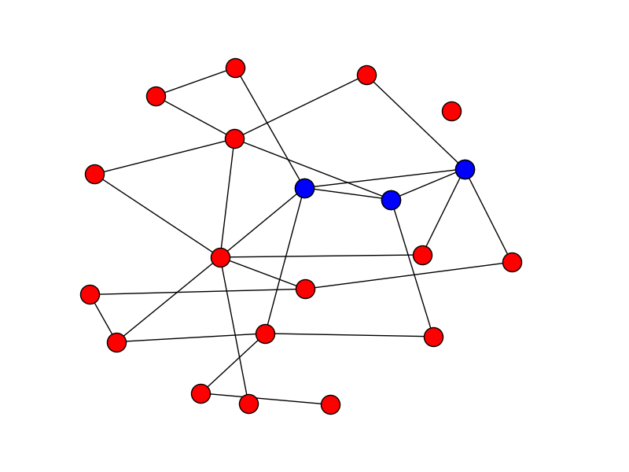
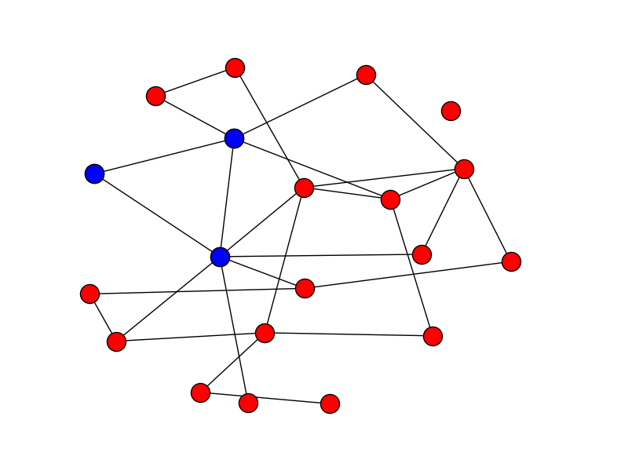
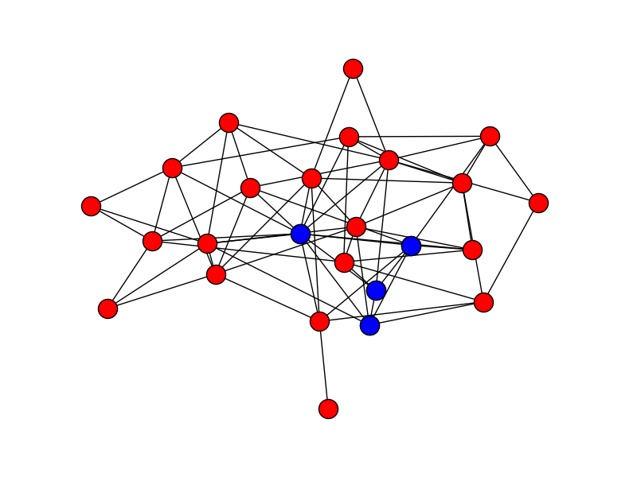
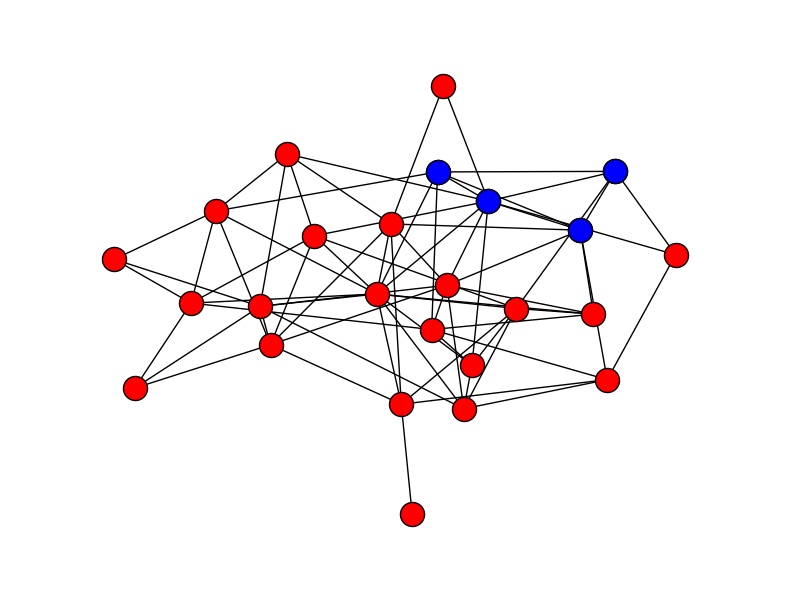

# Finding Trusses

Thanks to Edward Snowden we know much more than we used to about the way intelligence services work. So, [one of the documents he leaked]( https://www.documentcloud.org/documents/2702948-Problem-Book-Redacted.html) concerns the research activities of [GCHQ (Government Communications Headquarters)](https://en.wikipedia.org/wiki/Government_Communications_Headquarters). Reading the document, we can see that they are interested in detecting specific structures in graphs. The nodes in these graphs are people and the edges are links between them. The links may be communication channels such as phone calls, e-mails, etc. A structure that seems of particular interest to GCHQ is the k-truss, an idea that seems to come from the [National Security Agency](https://en.wikipedia.org/wiki/National_Security_Agency). 
 
A k-truss in a graph is a subset of the graph such that every edge in the subject is supported by at least k−2 other edges that form triangles with that particular edge. In other words, every edge in the truss must be part of k−2 triangles made up of nodes that are part of the truss. For example, in the following figures you can see two 3-trusses in a graph. By definition, 3-trusses are the triangles of a graph:



Similarly, in the following figure you can see a 4-truss of a graph. 4-trusses are sets of such that every edge is part of two triangles composed of nodes in the truss.



In the following figures you can see the 5-trusses of a graph:


## Maximal Truss Finding Algorithm

How do we find the maximal k-trusses of a graph? One way is with the following algorithm:

```
crummy_code_to_reduce_graph_to_k_truss(g, k)
    until no change do
        for each edge e = (a,b) in g:
            if (size(intersection(neighbours(a), neighbours(b)) < k - 2:
                remove e from g
    return remaining edges for each node 
```

In the above algorithm, `g` is the graph and `k` is the truss size. The function `neighbours(a)` gives us the neighbours of node `a`, the function `intersection(s1, s2)` finds the intersection of two sets `s1` and `s2`, and the function `size(s)` finds the size of the set `s`. The idea behind the algorithm is to reduce the graph so that in the end the connected components of the graph are maximal k-trusses. This algorithm is not very efficient, better ones do exist, but it will do for this assignment.

## Requirements

1. You will write a program named trusses.py that finds the maximal k-trusses of a graph.
2. You will represent the graph with adjacency lists, not with an adjacency matrix.
3. You will not use ready-made graph libraries.
4. Your program must be called as follows:
```
python trusses.py graph_file size_of_truss
```
The `graph_file` argument specifies the name of the file where the graph is stored. The file will have the following format:
```
0 2
1 3 
2 4
...
```
that is, it contains lines each one of which has two numbers. If the two numbers are `x` and `y`, the graph will have an edge between the nodes `x` and `y`. The graph is undirected, so we assume that there always exists the reverse edge from `y` to `x`. The nodes will be always consecutive integers starting from 0, i.e., 0, 1, 2, ... You cannot assume that the file contents are ordered in any way.

The argument `size_of_truss` is the truss dimension, i.e., the k in k-truss.

## Output
The program will print out the k-trusses of the graph, if they exist, in the form:
```
(0, 1, 9)
(8, 10, 16)
```
That is, each line will contain a truss inside square brackets, with the nodes separated by commas and whitespace. Every k-truss will be output only once, and the k-trusses will be output in order.

## Examples
If the user gives:
```
python trusses.py graph_1.txt 3
```
with the file [gnp_random_graph_1.txt](gnp_random_graph_1.txt), which actually corresponds to the graph of the first two figures with the 3-trusses above, the output will be the one we gave just above:
```
(0, 1, 9)
(8, 10, 16)
```
If the user gives:
```
python trusses.py graph_2.txt 4
```
with the file [gnp_random_graph_2.txt](gnp_random_graph_2.txt), the output will be:
```
(3, 8, 9, 18)
(7, 11, 15, 21)
```
If the user gives:
```
python trusses.py graph_3.txt 5
```
with the file [powerlaw_cluster_graph.txt](powerlaw_cluster_graph.txt), the output will be:
```
(2, 5, 8, 9, 13, 14)
(2, 5, 8, 13, 14)
(2, 8, 9, 13, 14)
```
If the user gives:
```
python trusses.py barabasi_albert_graph.txt 3
```
with the file [barabasi_albert_graph.txt](barabasi_albert_graph.txt), the output will be:
```
(0, 1, 2, 3, 4, 5, 6, 8, 9, 11, 12, 13)
(0, 1, 3, 4, 5, 6, 9, 10)
(0, 3, 4, 5, 8, 11)
(0, 3, 4, 5, 10, 11)
(0, 3, 5, 11)
(0, 4, 6, 10)
(1, 3, 4, 6, 7, 9, 10, 12)
(1, 3, 4, 6, 7, 13)
(1, 3, 9, 13, 14)
(1, 6, 7)
(2, 3, 6, 12)
(2, 3, 12)
(3, 4, 6, 9, 13, 14)
(3, 5, 8)
(9, 13, 14)
```
# Bibliography

* Jonathan Cohen, Trusses: Cohesive Subgraphs for Social Network Analysis, 2008 (http://www.csee.ogi.edu/~zak/cs506-pslc/trusses.pdf).

* Jonathan Cohen, Graph Twiddling in a MapReduce World, Computers in Science and Engineering, Vol. 11, issue 4, pp. 29-41, July/August 2009 (http://lintool.github.io/UMD-courses/bigdata-2015-Spring/content/Cohen_2009.pdf).
