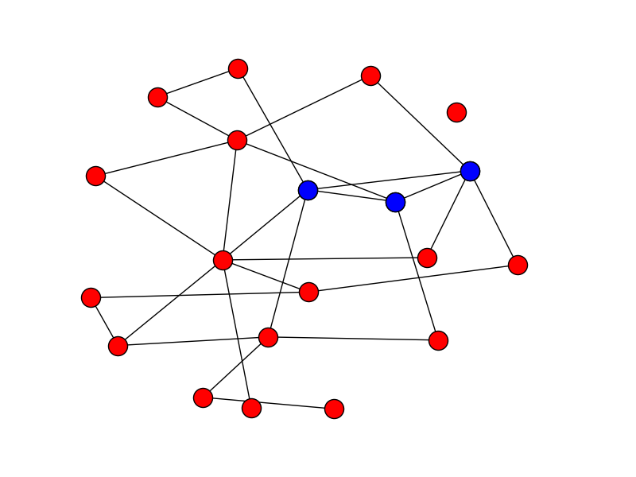
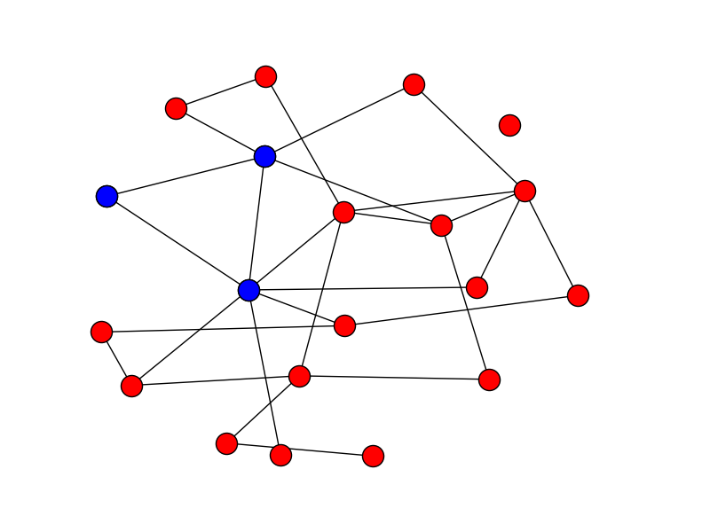
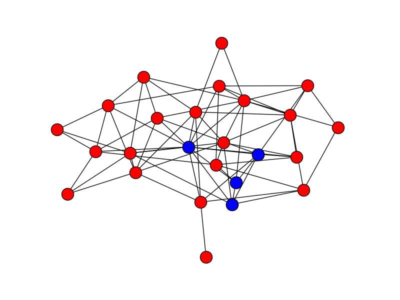
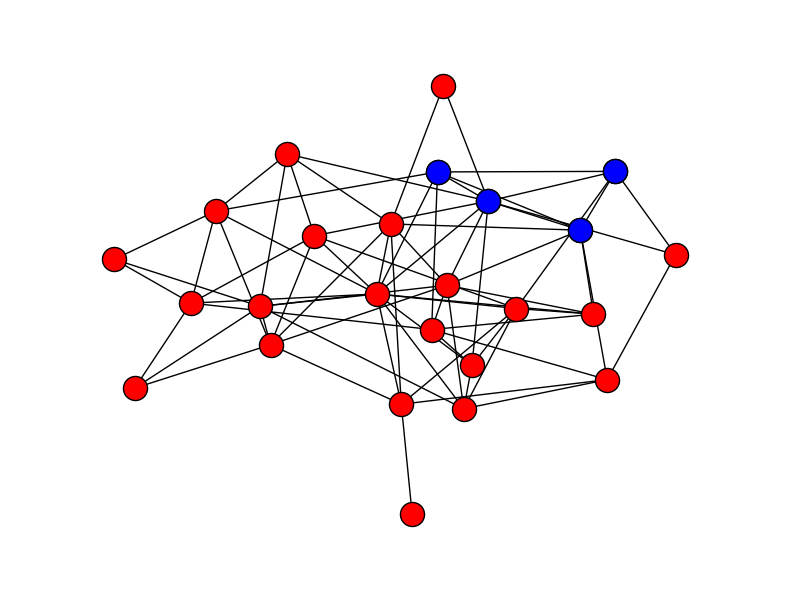
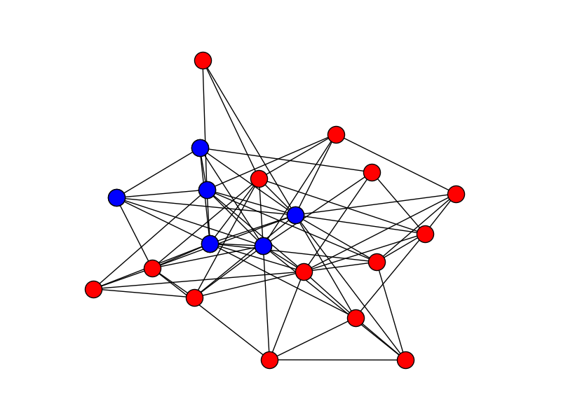
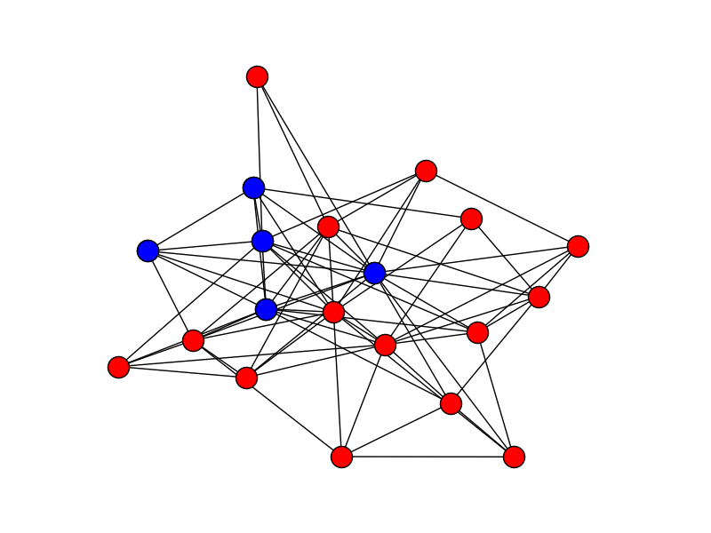
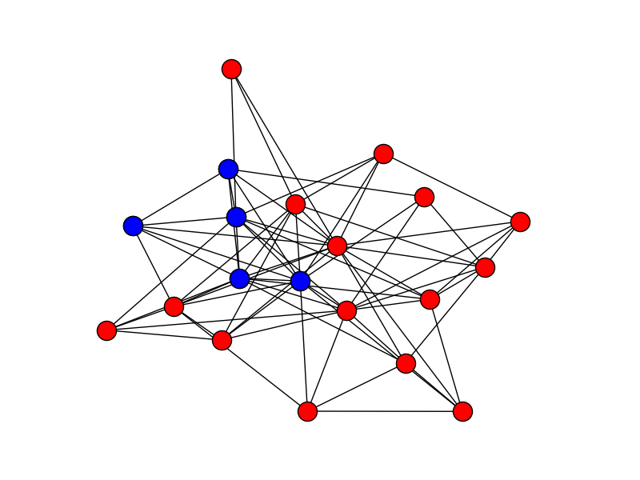
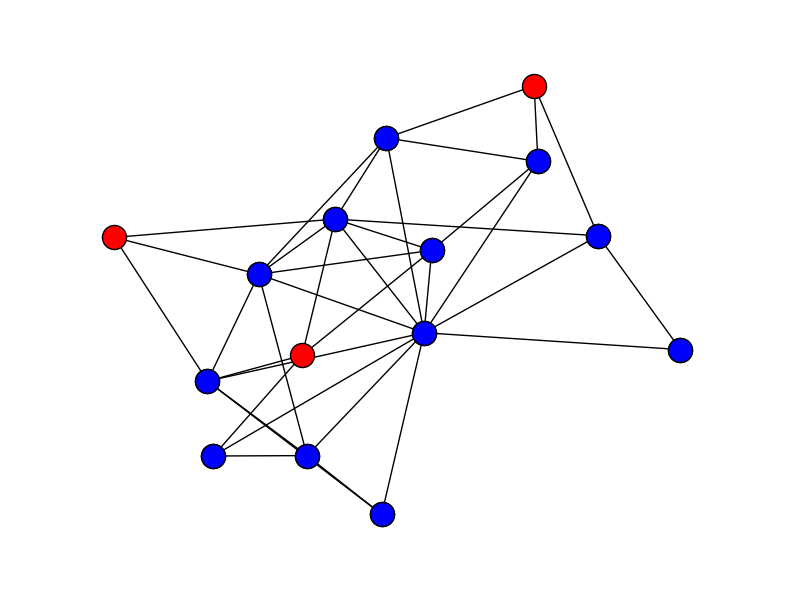

# Εύρεση Δικτυωμάτων σε Έναν Γράφο

Χάρη στον Edward Snowden γνωρίζουμε πλέον πολύ περισσότερα από ό,τι παλαιότερα για τον τρόπο που λειτουργούν οι μυστικές υπηρεσίες. Έτσι, [ένα από τα έγγραφα που έδωσε στη δημοσιότητα]( https://www.documentcloud.org/documents/2702948-Problem-Book-Redacted.html) αφορά στις ερευνητικές προσπάθειες της [GCHQ (Government Communications Headquarters)](https://en.wikipedia.org/wiki/Government_Communications_Headquarters), της Βρετανικής υπηρεσίας συλλογής στοιχείων. Εκεί βλέπουμε ότι οι κατάσκοποι ενδιαφέρονται για τον εντοπισμό συγκεκριμένων δομών σε γράφους. Οι γράφοι αυτοί αποτελούνται από άτομα και συνδέσμους μεταξύ τους, όπου οι σύνδεσμοι αντιστοιχούν σε επικοινωνίες όπως τηλεφωνικές κλήσεις, email, κ.λπ. Μια δομή που φαίνεται να τους ενδιαφέρει ιδιαιτέρως είναι τα k-δικτυώματα, τα οποία φαίνεται να προέρχονται ως ιδέα από την αμερικανική [National Security Agency](https://en.wikipedia.org/wiki/National_Security_Agency). 

Ένα *k-δικτύωμα* (k-truss) σε έναν γράφο είναι ένα υποσύνολο του γράφου τέτοιο ώστε κάθε σύνδεσμος του υποσυνόλου αυτού ενισχύεται από τουλάχιστον k - 2 ζεύγη άλλων συνδέσμων τα οποία σχηματίζουν τρίγωνο με τον εν λόγω σύνδεσμο. Με άλλα λόγια, κάθε ακμή του δικτυώματος θα πρέπει να ανήκει σε k - 2 τρίγωνα με κόμβους που ανήκουν στο δικτύωμα. Για παράδειγμα, στις παρακάτω εικόνες βλέπετε τα δύο 3-δικτυώματα που έχει ένας γράφος:



Ενώ στις παρακάτω εικόνες βλέπετε τα 4-δικτυώματα που έχει ένας γράφος:



Και στις παρακάτω εικόνες βλέπετε τα 5-δικτυώματα που έχει ένας γράφος:



## Αλγόριθμος Επίλυσης

Πώς βρίσκουμε τα k-δικτυώματα ενός γράφου; Ένας τρόπος είναι να ακολουθήσουμε τον παρακάτω αλγόριθμο:

```
crummy_code_to_reduce_graph_to_k_truss(g, k)
    until no change do
        for each edge e = (a,b) in g:
            if (size(intersection(neighbours(a), neighbours(b)) < k - 2:
                remove e from g
    return remaining edges for each node 
```

Στον παραπάνω αλγόριθμο, `g` είναι ο γράφος και `k` είναι το μέγεθος των δικτυωμάτων που ψάχνουμε. Η συνάρτηση `neighbours(a)` μας δίνει τους γείτονες του κόμβου `a`, η συνάρτηση `intersection(s1, s2)` βρίσκει την τομή των συνόλων `s1` και `s2`, και η συνάρτηση `size(s)` βρίσκει το μέγεθος του συνόλου `s`. Ο αλγόριθμος αυτός δεν είναι ιδιαίτερα καλός, υπάρχουν πιο αποτελεσματικοί, αλλά μας κάνει στο πλαίσιο της εργασίας.

## Απαιτήσεις Προγράμματος

Κάθε φοιτητής θα εργαστεί στο προσωπικό του αποθετήριο στο GitHub. Για να αξιολογηθεί μια εργασία θα πρέπει να πληροί τις παρακάτω προϋποθέσεις:

1. Όλη η εργασία θα πρέπει να βρίσκεται σε έναν κατάλογο `assignment-2016-1` μέσα στο αποθετήριο του φοιτητή.
2. Το πρόγραμμα θα πρέπει να έχει όνομα `trusses.py`.
3. Για την υλοποίηση του γράφου θα πρέπει να χρησιμοποιήσετε λίστες γειτνίασης (adjacency lists) και όχι πίνακα γειτνίασης (adjacency matrix). Εννοείται ότι δεν επιτρέπεται η χρήση έτοιμων βιβλιοθηκών γράφων.
4. Το πρόγραμμα θα μπορεί να καλείται ως εξής:
```
python trusses.py graph_file size_of_truss
```

* Η παράμετρος `graph_file` δίνει το όνομα του αρχείου στο οποίο είναι αποθηκευμένος ο γράφος (αυτό δεν σημαίνει ότι το αρχείο ονομάζεται ντε και καλά `graph_file`, ο χρήστης μπορεί να δίνει οποιοδήποτε όνομα). Το αρχείο θα είναι της μορφής:
```
0 2
1 3 
2 4
...
```
δηλαδή αποτελείται από γραμμές που η κάθε μία περιέχει δύο αριθμούς. Αν οι δύο αριθμοί είναι οι `x`, `y` ο γράφος θα έχει ένα σύνδεσμο μεταξύ των κόμβων `x` και `y`. Ο γράφος δεν θα είναι κατευθυνόμενος, άρα θα θεωρούμε πάντα ότι θα υπάρχει και ο αντίστροφος σύνδεσμος από το `y` στο `x`. Οι κόμβοι θα είναι πάντα αριθμοί και θα είναι 0, 1, 2, ... Δεν μπορείτε να θεωρήσετε ότι το αρχείο είναι ταξινομημένο με οποιονδήποτε τρόπο.

* Η παράμετρος `size_of_truss` είναι το μέγεθος του δικτυώματος, δηλαδή το k στο k-δικτύωμα.

### Περιγραφή Εξόδου

Η έξοδος του προγράμματος θα ιχνηλατεί τη λειτουργία του, και θα είναι *ακριβώς* όπως περιγράφεται στη συνέχεια. *Προσοχή:* αν η έξοδος δεν είναι ακριβώς σύμφωνη με την περιγραφή της, η εργασία *δεν θα μπορεί να αξιολογηθεί*.

Το πρόγραμμα θα εμφανίζει τα k-δικτυώματα του γράφου, αν υπάρχουν, με τη μορφή:
```
(0, 1, 9)
(8, 10, 16)
```
δηλαδή σε μία γραμμή θα εμφανίζεται το δικτύωμα, μέσα σε παρενθέσεις, και με τους κόμβους χωρισμένους με κόμμα και κενό μεταξύ τους. 

* Κάθε k-δικτύωμα θα εμφανίζεται μόνο μία φορά.

* Τα k-δικτυώματα θα εμφανίζονται ταξινομημένα (βλ. παρακάτω στα παραδείγματα εκτέλεσης).

### Παραδείγματα Εκτέλεσης

* Αν ο χρήστης δώσει:
```
python trusses.py gnp_random_graph_1.txt 3
```
με τo αρχείo [gnp_random_graph_1.txt](gnp_random_graph_1.txt), το οποίο αντιστοιχεί στον πρώτο γράφο, η έξοδος θα είναι:
```
(0, 1, 9)
(8, 10, 16)
```

* Αν ο χρήστης δώσει:
```
python trusses.py gnp_random_graph_2.txt 4
```
με τo αρχείo [gnp_random_graph_2.txt](gnp_random_graph_2.txt), το οποίο αντιστοιχεί στο δεύτερο γράφο, η έξοδος θα είναι:
```
(3, 8, 9, 18)
(7, 11, 15, 21)
```

* Αν ο χρήστης δώσει:
```
python trusses.py powerlaw_cluster_graph.txt 5
```
με τo αρχείo [powerlaw_cluster_graph.txt](powerlaw_cluster_graph.txt), το οποίο αντιστοιχεί στον τρίτο γράφο, η έξοδος θα είναι:
```
(2, 5, 8, 9, 13, 14)
(2, 5, 8, 13, 14)
(2, 8, 9, 13, 14)
```

* Αν ο χρήστης δώσει:
```
python trusses.py barabasi_albert_graph.txt 3
```
με το αρχείο [barabasi_albert_graph.txt](barabasi_albert_graph.txt), η έξοδος θα είναι:
```
(0, 1, 2, 3, 4, 5, 6, 8, 9, 11, 12, 13)
(0, 1, 3, 4, 5, 6, 9, 10)
(0, 3, 4, 5, 8, 11)
(0, 3, 4, 5, 10, 11)
(0, 3, 5, 11)
(0, 4, 6, 10)
(1, 3, 4, 6, 7, 9, 10, 12)
(1, 3, 4, 6, 7, 13)
(1, 3, 9, 13, 14)
(1, 6, 7)
(2, 3, 6, 12)
(2, 3, 12)
(3, 4, 6, 9, 13, 14)
(3, 5, 8)
(9, 13, 14)
```

Το πρώτο δικτύωμα φαίνεται στην παρακάτω εικόνα:



Παρατηρείστε ότι:
* Ένα k-δικτύωμα δεν είναι απαραίτητο να αποτελείται από k κόμβους.
* Ένα k-δικτύωμα δεν είναι απαραίτητο να αποτελείται από κόμβους που είναι πλήρως συνδεδεμένοι μεταξύ τους.

Επαναλαμβάνουμε ότι η μορφή της εξόδου θα πρέπει να είναι ακριβώς όπως η παραπάνω για να μπορεί να αξιολογηθεί η εργασία.

Καλή Επιτυχία.

# Περισσότερες Πληροφορίες

* Jonathan Cohen, Trusses: Cohesive Subgraphs for Social Network Analysis, 2008 (http://www.csee.ogi.edu/~zak/cs506-pslc/trusses.pdf).

* Jonathan Cohen, Graph Twiddling in a MapReduce World, Computers in Science and Engineering, Vol. 11, issue 4, pp. 29-41, July/August 2009 (http://lintool.github.io/UMD-courses/bigdata-2015-Spring/content/Cohen_2009.pdf).
